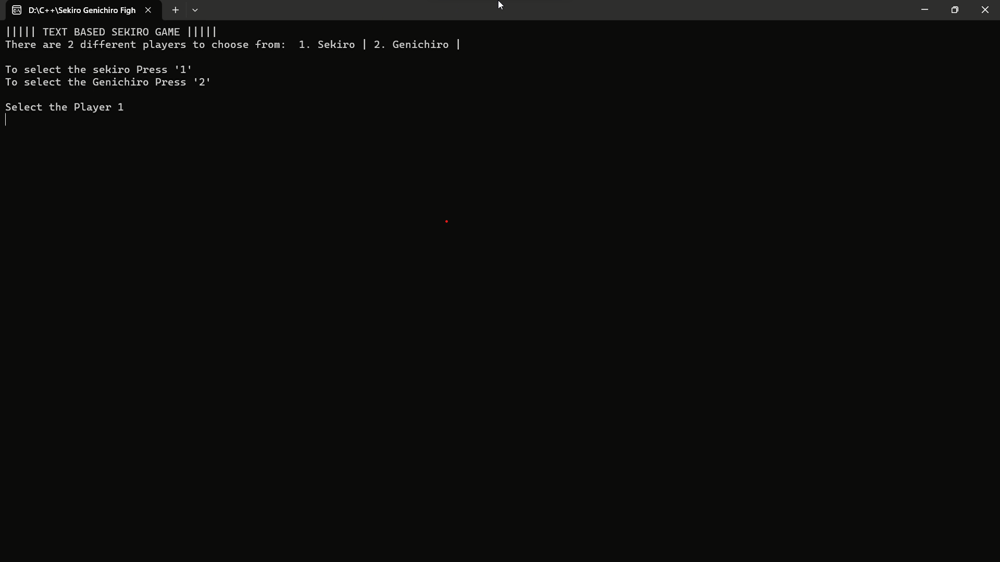
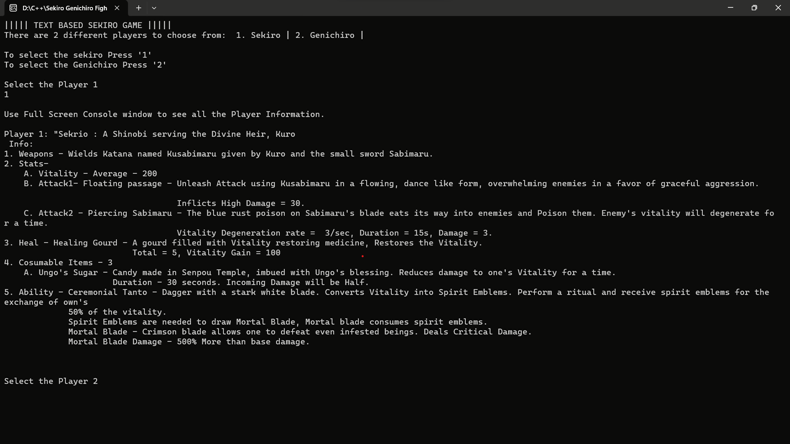
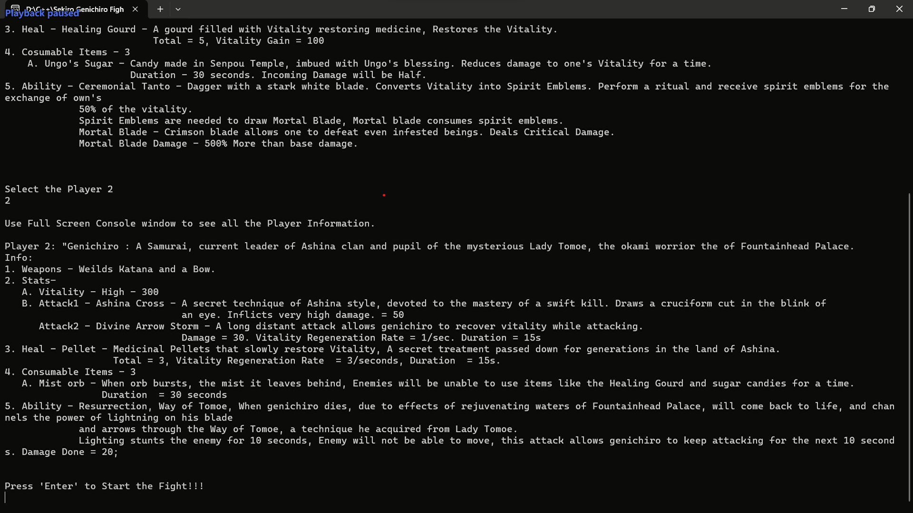
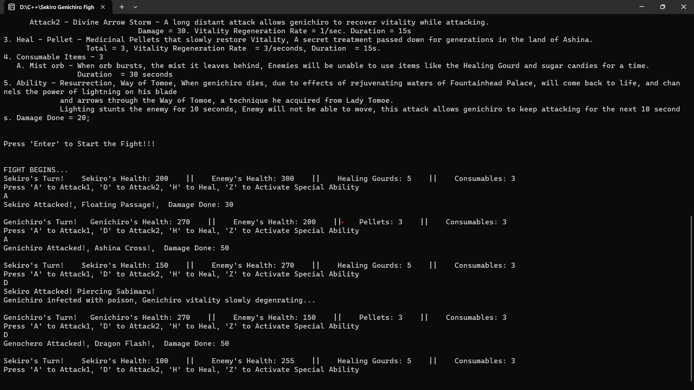
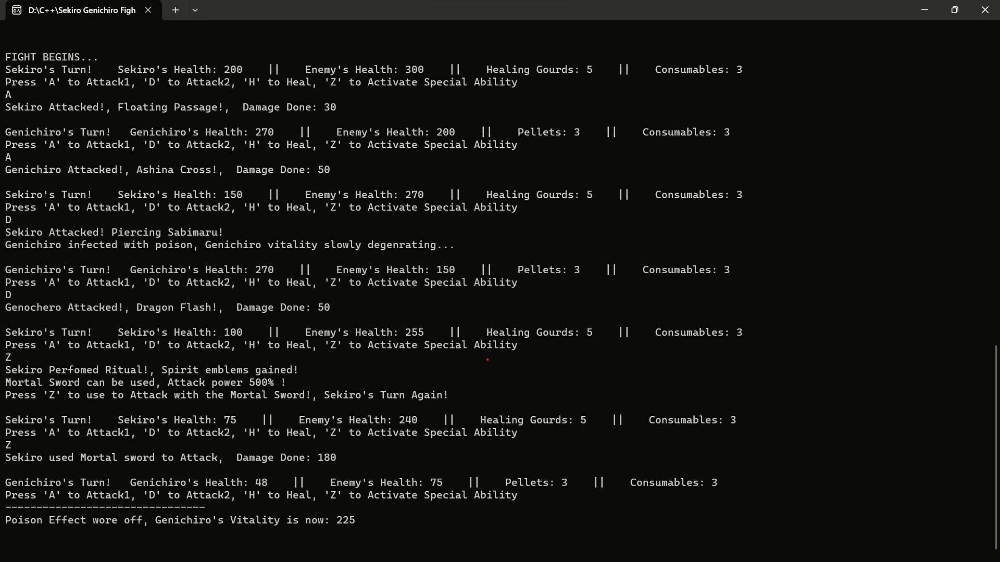
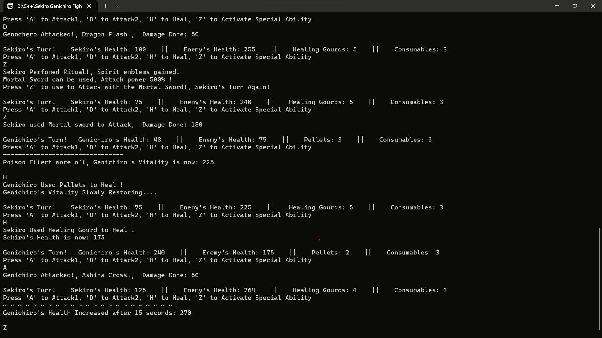
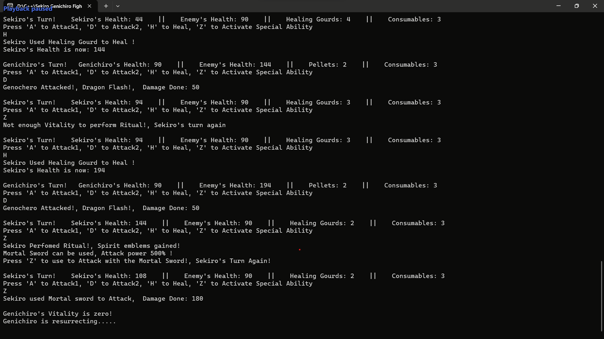
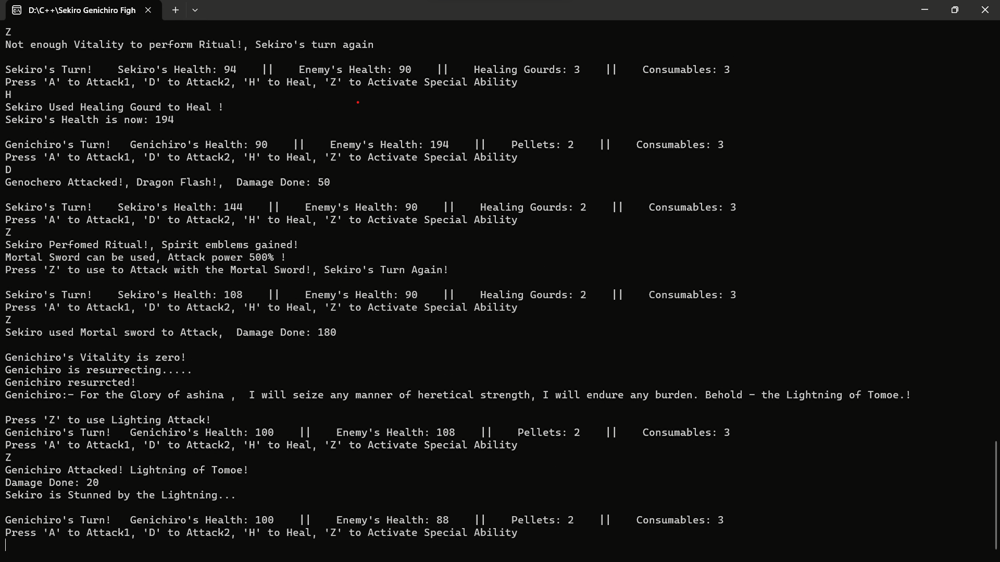

# Sekiro Fight Console

### Overview

    Experience the intense battle between Sekiro and Genichiro in this console-based game. Engage in strategic
    combat, utilize different attacks, items, and defeat your enemy to emerge victorious. The game is designed
    for the console environment, providing an experience reminiscent of the epic encounters in "Sekiro: Shadows Die Twice."
    
### Features

    - Diverse Characters:
        - Choose between Sekiro and Genichiro, each with distinct weapons and abilities.
        - Explore detailed character backgrounds for an immersive gaming experience.

    - Strategic Gameplay:
        - Make tactical decisions based on each character's strengths and weaknesses.
        - Utilize a variety of attacks, healing items, and consumables strategically.

    - Dynamic Combat:
        - Experience dynamic combat with unique special attacks for each character.
        - Witness intense battles and unleash critical damage.

    - Healing Mechanism:
        - Manage vitality using healing items and strategic consumables.
        - Deploy Ungo's Sugar and Mist Orb for tactical advantages.

    - Special Abilities:
        - Unleash powerful abilities such as Sekiro's "Ceremonial Tanto" and Genichiro's 
          "Resurrection, Way of Tomoe."

    - Immersive Stats:
        - View detailed stats for each character, enhancing strategic decision-making.
        - Enjoy full-screen console support for seamless gameplay.

    - Inspiration from "Sekiro: Shadows Die Twice":
        - Immerse yourself in a game inspired by the world of "Sekiro: Shadows Die Twice."
### Screenshots
   
   
   
   
   
   
   
   

### Implementation

#### Character.cpp:

    - Serves as the base class for all characters in the game.
    - Defines common attributes and behaviors shared by characters.
    - Includes virtual functions for specific actions like attacking and taking damage.
    - Implements polymorphism, allowing derived classes to override and provide custom implementations.

#### Sekiro.cpp:

    - Derived class from Character.cpp, representing the player character Sekiro.
    - Implements specific characteristics and moves of Sekiro, such as the poisonous sword's lingering impact.
    - Utilizes std::async to execute functions concurrently, enhancing the dynamic nature of the combat.

#### Genichiro.cpp:

    - Derived class from Character.cpp, representing the enemy character Genichiro.
    - Implements Genichiro's unique attacks, such as the lightning arrow attack.
    - Leverages std::async for concurrent execution, allowing for continuous attacks after the lightning arrow.
    
#### GameInfo.h

    - The GameInfo class provides detailed information about different players.
    - Each player, such as Sekiro and Genichiro, is represented with unique attributes, including stats, 
      attacks, heals, consumable items, and abilities.
    
### How to Play

    1. Run the game in a full-screen console window.
    2. Choose your character (1 for Sekiro, 2 for Genichiro).
    3. Engage in a turn-based battle using attacks, healing items, and consumables.
    4. Strategically defeat your opponent to emerge victorious.
    
    Note : For an optimal gaming experience, familiarize yourself with the characters' abilities and stats
    provided in the player information section. Enjoy the thrilling clash between two legendary warriors!

### Gameplay Demonstration
    - For a visual demonstration of the gameplay, watch video on YouTube:
[Youtube video link](https://youtu.be/AEvcNip_Q2U)

### Play the Game
    - To experience the game firsthand, play it by downloading folloling .exe file:
[Download .exe file](https://drive.google.com/file/d/1MgIx_P3XUEMyJfa-0L57TVIKvNDKpJNf/view?usp=drive_link)

